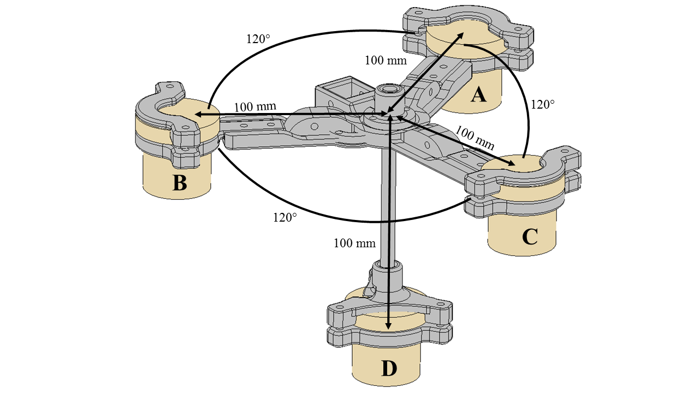

# TDOA_SONAR
SONAR repository for locating underwater pingers using Time Difference Of Arrival (TDOA)

Includes Advantech hardware driver (from Advantech), Advantech ROS driver cpp (from me), and Python nodes for analyzing signals.  
  
Still have to clean up the code (it's a mess) and add README documentation. Loop a bag file (Feb 4, 2018 has some good ones) and enter "roslaunch tdoa_sonar_software localization.launch". Should show active plots of conditioned pings. 

Distributor ID:	Ubuntu  
Description:	Ubuntu 14.04.5 LTS  
Release:	14.04  
Codename:	trusty  
Kernel: Linux SONAR 4.4.0-93-generic #116~14.04.1-Ubuntu SMP Mon Aug 14 16:07:05 UTC 2017 x86_64 x86_64 x86_64 GNU/Linux  

